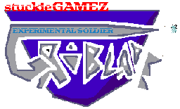
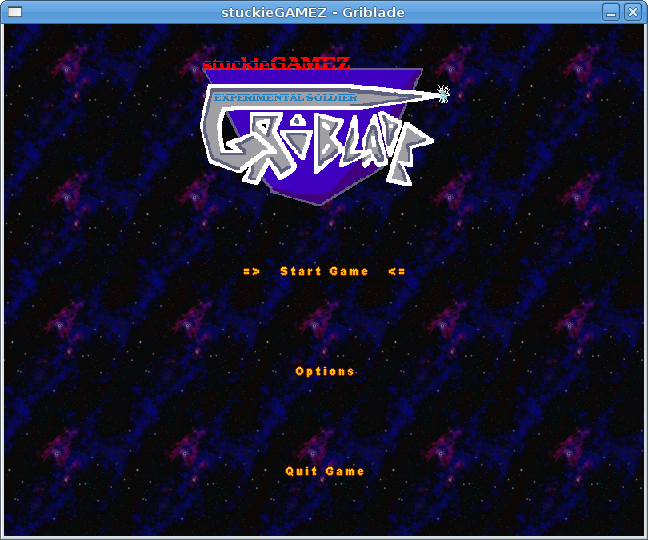
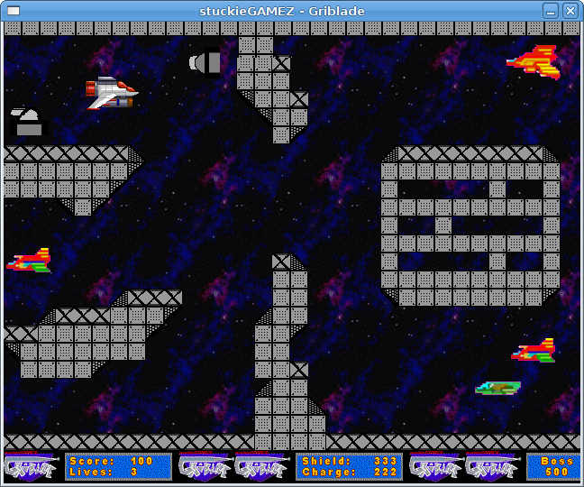

# Griblade

## Background
Griblade was created for the Main Playstation 2 Graphics Coursework in Second Year ( the first coursework was using ncurses with pad support - where Tiny Critters was born! ) 
Originally, I was planning on doing Scavengers - a sort of first person game heavily based upon Games Workshop's Space Hulk, but set in the CHARGE!!! universe, where you had to scavenge from derelict ships to keep yourself alive, and deal with any nasties that were on the ship. 
However, my raycaster ran slow as treacle, so that was scrapped and Griblade was born. 
Griblade was going to borrow heavily from Turrican and R-Type. The mass amount of sprite work needed for platformer sprites meant that for the coursework, I'd cut it down to a side-scrolling shooter.
        
## Screenshots

## Downloads
This is where the first instance of the SGameZ Engine was created - a multi-platform game engine and the proof is still in the code as it will compile and run on PS2Linux, PC and GP2X - in fact binaries for the GP2X and Windows are supplied, along with Makefiles and a CodeBlocks Project. 
-- not yet --

## Griblade Soundtrack
[Title Track](https://soundcloud.com/steven-campbell-628493895/griblade-title) 
[Ingame - The Escape](https://soundcloud.com/steven-campbell-628493895/griblade-ingame-1) 
[Ingame - Underground Maze](https://soundcloud.com/steven-campbell-628493895/griblade-ingame-2) 

## Resources
    
Some graphics by Neil MacNaughton ( the good ones ;) )
SFont code by Karl Bartel

## Project Status

Due to it being a coursework that was done a long time ago, it has served it's purpose, even though was LARGELY unfinished.
That said, I'm hoping to go back to it and finish it off to the original design specs.
