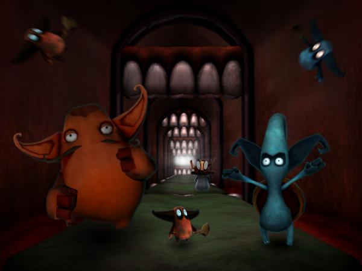
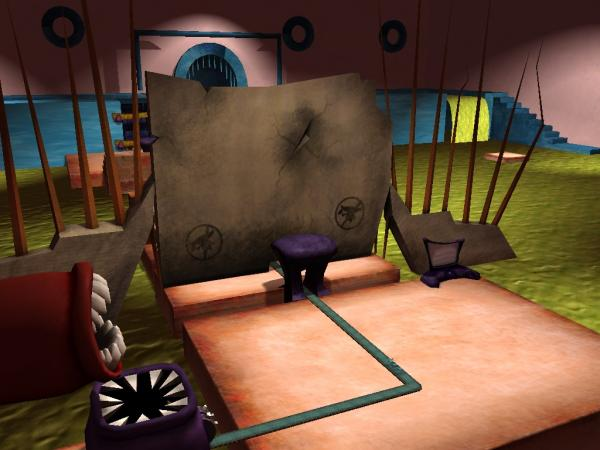
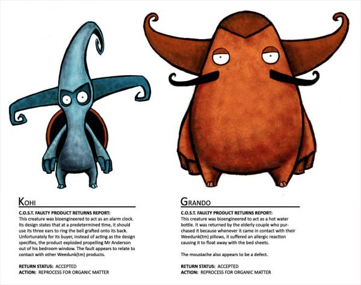

I took part in Dare To Be Digital 2008 as a member of Team Caffeine. We produced the game Plight of The Weedunks in just ten weeks.

&nbsp;

  

    Team Caffeine
  

  
  

    
  

# Plight Of The Weedunks

As part of Team Caffeine, I was responsible for the engine, tool-chain, COLLADA Converter, and general gameplay scripting.

In essence, I was the Lead Programmer, in a team of five &#8211; two programmers, two artists and a producer/designer.

We took part in Dare to be Digital 2008.

Plight of The Weedunks was called a &#8220;puzzle-platformer&#8221; however, the bias as to which was puzzler and which was platformer was never really discussed a great deal. This caused a communication nightmare as we designed an engine primarily for small scale puzzle rooms, where the levels ended up being sprawling platform areas.

On the plus side, we managed to keep the polycount down low enough that in the end, it didn&#8217;t quite matter, and if it wasn&#8217;t for me chasing up imaginary bugs created from a dying workstation, we probably would have gotten a lot more done.

Using my Honours Project engine &#8211; SGZEngine &#8211; as a starting block, we then added ODE for Physics, Horde3D for 3D Graphics and modified their Collada Converter to pick up on the extra bits Maya adds to the FCOLLADA format.

Within just ten weeks, we had modified the engine and scripted a prototype game!

Although it doesn&#8217;t really match any of our visions of what the game was going to end up as, we are all extremely proud of what we produced in such a short amount of time, and even through some of the communication breakdowns we suffered.

We learned a great deal from the experience, and that&#8217;s exactly what Dare to be Digital is all about!

# Screenshots

Promotional Image  

Ingame Image  

Concept Image  

# Downloads

[Source is available](https://github.com/stuckie/plightoftheweedunks)

You WILL require two gamepads to play, as it is strictly a two player game!

The included README will guide you on some extra setup features to get the game running as best as possible on your machine, as it does require a rather hefty setup to run &#8211; OpenGL 2.0 compliance ( which equates to Shader Model 2, roughly ) at the very least, for example.

# Resources

As said, programming wise, we started from my Honours Project and added support for ODE and Horde3D to the engine.

Graphics wise, Adobe Photoshop CS3 and Autodesk Maya 2008 were used.

SVN was used to keep code revisions and Perforce was used for the artists.

I&#8217;d also like to thank:

Nicolas &#8216;marciano&#8217; Schulz and Volker Wiendl for Horde3D and the rest of the community giving us an incredible amount of support!

Mark Hobbs from Philips amBX for the help he gave us with the amBX kits.

Grant Clarke for various programming solutions!

Ken Fee for his words of wisdom.

Realtime Worlds for sending over an army of programmers to help us debug!

The Dare to be Digital organisers for putting up with us!

The rest of the Dare staff and mentors who helped the artists and our producer/designer!

# Project Status

Complete!

We survived the ten weeks, and came second in the amBX usage prize!

# Additional Information

Jonny has written up some game background and the all important controls. Here&#8217;s what he has to say:

&#8212; What You Need to Play the Game &#8212;

* Two PS2 controllers (PS3 controllers may work but have not been tested).

* A PS2 to USB converter for the controllers.

Here is a link to the converter we used <http://www.amazon.com/Playstation-2-PC-USB-Gamepad-Converter/dp/B000F6BGXY>

* A good G-Force graphics card, preferably 8600GT or better.

* Speakers/headphones turned on with the volume reasonably loud  
&#8212; How to Play the Game &#8212;

* The game needs 2 players, there is no 1 player mode.

* You must work together and use the character&#8217;s allergic reactions to Weedunks (little guys with the hammers) to get past obstacles and progress through the levels (though not really true for the first level &#8211; Toothy the Tunnel level &#8211; you just need to get to the very end in one piece!)

&#8212; Controls &#8212;

The controls are laid out on the UI and are context sensitive, but&#8230;

* Press the X button to jump.

* When beside a Weedunk press circle to pick him up.

* Pressing circle again will through the Weedunk and the Weedunk will go splat! when it hits something.

* But, instead of throwing the Weedunk you can target the other player first (by holding down the R2 button) and then throw the Weedunk by pressing cirlce. Hitting the other player with a Weedunk causes the other player&#8217;s character to have an allergic reaction!

* Also, instead of picking up the Weedunk you can take control of him (this is called &#8220;transplant&#8221; in the game) by pressing the square button when beside him. To release control of the Weedunk press the triangle button.

* And, instead of throwing the Weedunk at the other player you can cause a &#8216;combined allergic reaction&#8217;!!! With a Weedunk in hand press the triange button beside the other player.

* Very Important! &#8211; With Grando&#8217;s allergic reaction evoked the player controlling him can increase his height by holding down the X button for maximum upward thrust!

* Important! &#8211; Both players control the result of Kohi&#8217;s (the small blue character) &#8216;combined allergic reaction&#8217;.  
&#8212; Controls Reiterated &#8212;

* X button to jump, and to control Grando&#8217;s allergic reaction&#8217;s thrust.

* Cirle button to pick up Weedunk, and to throw Weedunk.

* Square button to take control of weedunk

* Triangle button to start &#8216;combined allergic reaction&#8217;, to release a Weedunk, and to halt an allergic reaction

* R2 (shoulder button) to target the other player
