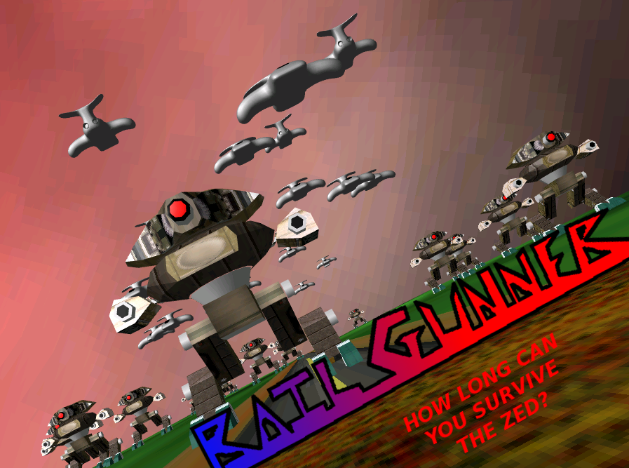
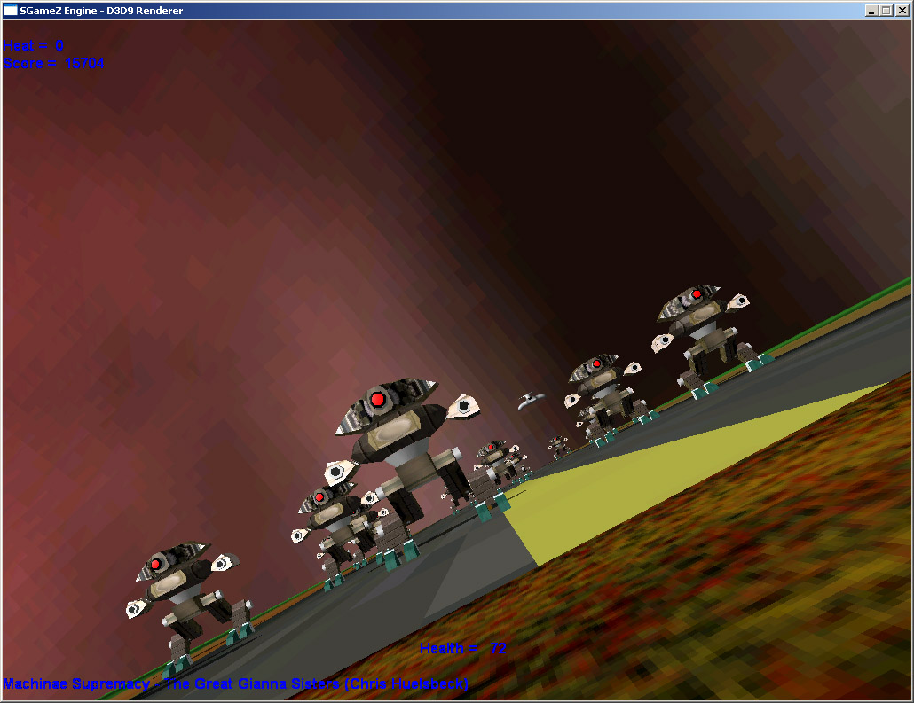

# RailGunner

## Overview

Railgunner was originally created for the Third Year Direct3D Coursework. It was then used again for the DirectSound Coursework the same year.  
Basically, you&#8217;ve to destroy anything that comes near you and survive as long as possible with things getting progressively harder.  
Version One only lasts three minutes as it&#8217;s meant to be synchronised to a music track ( though I think I messed this up to make the level slightly easier at one point. )  
Version Two lasts indefinitely, until you die, or get bored and quit.

## Screenshots of Version One

Title  

Ingame  

## Version Two

Version Two was created for the DirectSound coursework and is meant to be played via audio only &#8211; no graphics.  
This makes it much more difficult as you need to be aware of your surroundings via audio only.  
Needless to say, when one is partially deaf, it was great fun to program!

## Downloads

Version One is just the binary.  
Version Two also contains full source + CodeBlocks project file + the &#8220;fiddled with&#8221; DirectX SDK that was used for both versions.

## Resources Used

[Codeblocks](http://www.codeblocks.org) 
[MinGW Toolkit](http://www.mingw.org) 
A modified DirectX SDK ( included in Version Two )  

## Project Status

It was created for a coursework and I don&#8217;t quite see myself going back to it.  
Was not fond of DirectX at all, so maybe if I ported it to OpenGL and made it more game-like I would go back to it but chances are slim&#8230;
