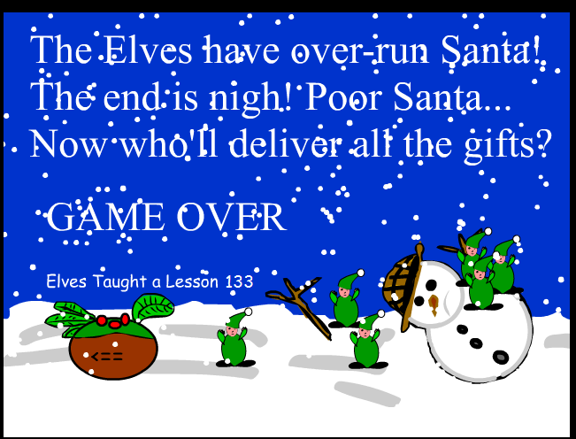

# Santa&#8217;s Elves

## Overview

Santa&#8217;s Elves was created for the Computer Games Technology Flash coursework in First Year.  
I thought as it was coming up to Christmas, I would create a festive little game!  
It is basically a survival shooter&#8230; you control Santa at the bottom of the screen, and have to survive the onslaught of ever-increasing Elves from the top!

## Screenshots

## Play The Game!

[You can play the game by clicking here!](santa.html) ( Although you will need Flash installed and working... )

## Downloads

The FLA is now available, after me originally losing it but finding it on an incredibly old backup disc!  
[Santa&#8217;s Elves (1mb FLA)](Santa.fla)

## Resources Used

Macromedia Flash 2004MX  
A random tune from modarchive.com

## Project Status

It was created for a coursework and as a bit of fun.. it&#8217;s served it&#8217;s purpose.
