# Tiny Critters

So, Tiny Critters was originally started in 2005 and released as part of a PS2Linux coursework using ncurses.
Which looked something like this:

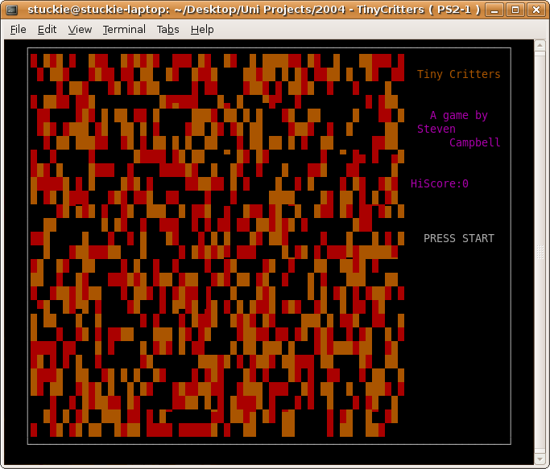
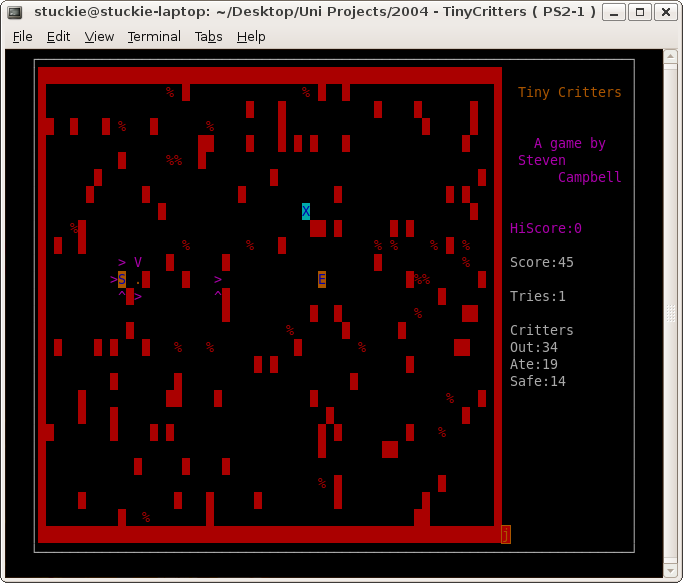

And was in effect a Chu Chu Rocket clone.

I did however like the idea of it, and little creatures running around, as well as a more grounded character within the world that you controlled much like Troddlers.
So, I then started doodling and came up with these three characters:

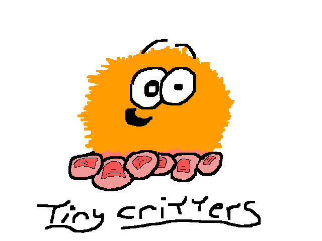
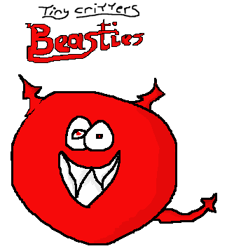
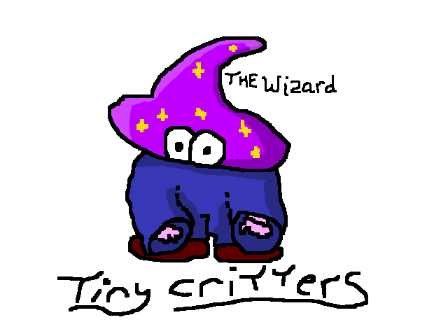

And drew some sprites as well:

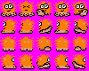
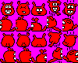
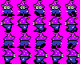
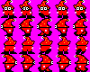

Made some music:
[Title Music](https://soundcloud.com/steven-campbell-628493895/tiny-critters-title)

And put together a sprite test while working on my Honours project:

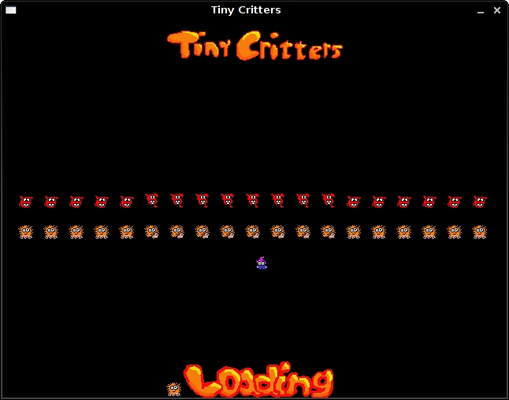

There were even some levels designed!

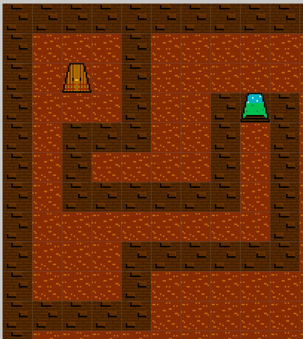  
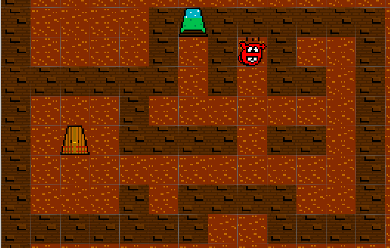  
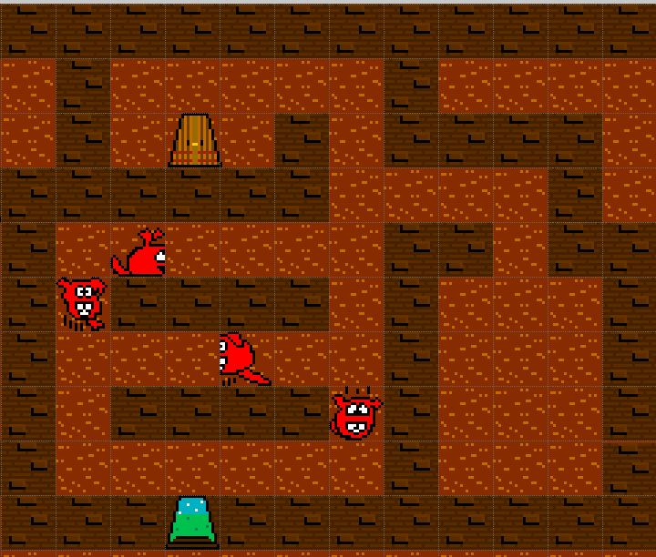  

These were playable, there did exist a small 5 level playable demo.... 
But it got lost in a hard drive crash, and that hurt a bit as I was rather invested in this one.

So... over a decade later, I've started looking into it again as an Arcade Badgers game.

This has been restarted a number of times, so hopefully, this time, we can get it out!
