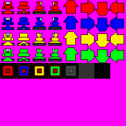

# Wobots

    
## Overview
Wobots was originally designed for the Network Game Programming coursework.
We had to design some form of game-like application that was networked with a variant of dead-reckoning to provide smooth gameplay.
I decided to extend SGZEngine ( which was half way through it's development point at this time ) to include a Distributed Interactive Simulation system for networking. In regards to the engine, all this meant was extending the event system a bit further and linking it with the network layer so that neither client or server really cared where each other was, as long as they received update packets when needed.
Unfortunately, I was incredibly ill at this point in time, so the project did not get completed even though the graphics were finished, the network implementation mostly complete and the packet structure set.
I'll possibly go back and fix this later.

## Concept Sprites

## Downloads
-- not yet --

## Resources Used
SGZEngine 
GIMP for graphics
