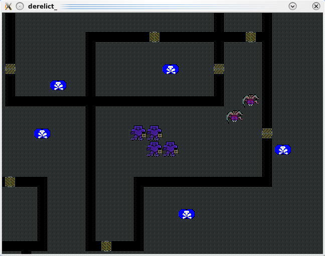
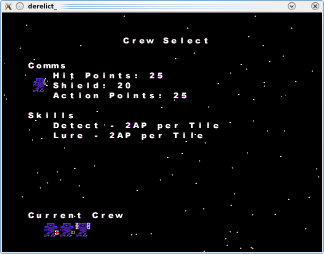
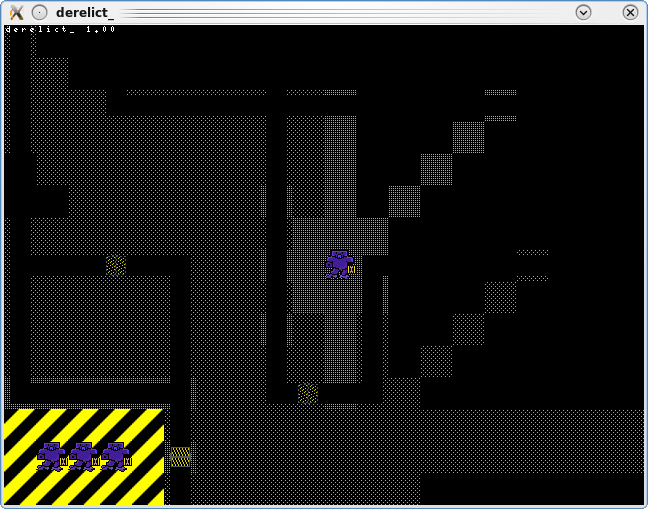
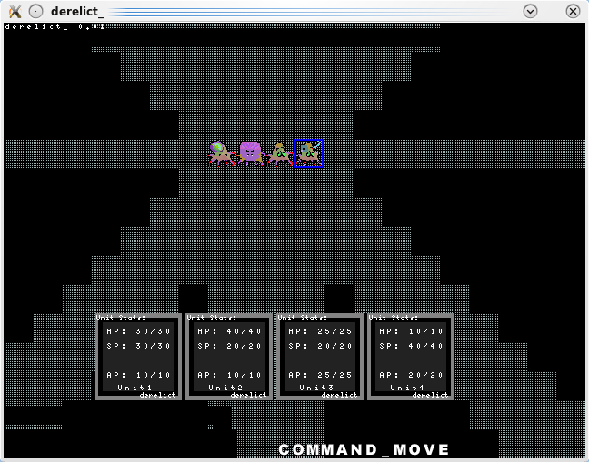

# derelict_

## Overview

A hulking mass of metal drifts  
effortlessly through space.  
Once teeming with life,  
now quiet like the dead of the night.  
This is a derelict.  
For the brave amongst you,  
there are unbound treasures aboard  
worth unimaginable fortunes,  
with a wealth of information  
just laying for the taking.  
However.  
This is a derelict for a reason.  
Pray you never find out why.

## Development Screenshots

  

## Project Progress

This was created as an entry for Ludum Dare.

I did, however, bite off a bit much.. I was also, again, a bit ill at the time &#8211; fighting off some flu-like thing &#8211; so ended up sleeping as normal, which knocked off a good 14 hours at least!

While a lot of the structural stuff is in there, and there&#8217;s a lot of content, there&#8217;s also a lot of core elements sadly missing.

Crucially, there&#8217;s a distinct lack of feedback.. so although you can move and fire, you have no idea how many action points each costs, how much you&#8217;ve used, how much is left, or if you&#8217;ve even successfully fired and hit something!

This was due to a lack of design which I didn&#8217;t think would need much time, when in actual fact, is what really makes or breaks a game such as this &#8211; how information is relayed to the player, and how the player interacts with their units.

Added to the fact I basically coded the game twice, due to an idiot decision of adding in multiplayer hotseat support either too early, or too late. It was in the original plan, but I jerry-rigged it in at a bad time while I was implementing some core changes, which completely destroyed a lot of working code that had to be redone. As much as I was using SVN, I was not committing nearly as often as I should have, and this buggered me up further as I should&#8217;ve been able to just revert back a bit and continue on.

That said, I did get a lot done.. a lot of the unit types and characteristics are coded, although not linked up fully. There is also a fair amount of re-usable code, and some of the &#8220;five minute fillers&#8221; added a fair bit of polish to the front end.

It&#8217;s a shame that the core of the game is incomplete.

## Future Work

Like Moons of Subterrane, derelict_ was an idea that I&#8217;ve had for a while and always wanted to do.

Now I have a functional base, I can go back to it and finish it off at my own pace.

## Downloads

[Full Source is available as part of the ludumdare github repo](https://github.com/stuckie/ludumdare)

## Resources Used

SGZEngine.

GIMP for graphics.

KATE for Lua code editing.

CodeLite for C/C++ engine editing.
