# Moons of Subterrane

## Overview

We&#8217;ve been doing research around the Moons of Subterrane for a while now,

though unfortunately the locals have decided they&#8217;re not too happy about it anymore.

They&#8217;ve unleashed a horde of vicious monsters into the caves we have been researching in.

Your job is to clear these caves and rescue our researchers.

Of course, the natives have also managed to destabalise each sector of the Moon we&#8217;re in,  
so you&#8217;ve only got a set amount of time before it tears itself apart!

## Development Screenshots

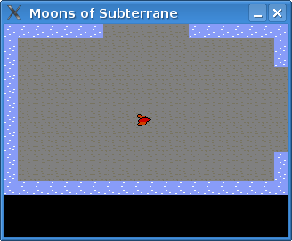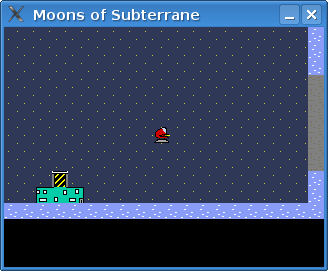
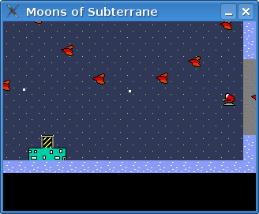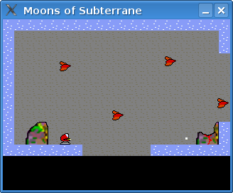
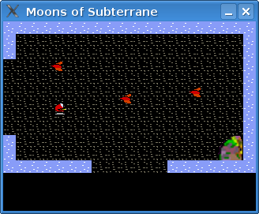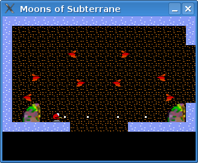
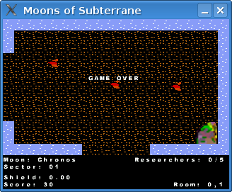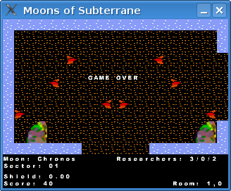
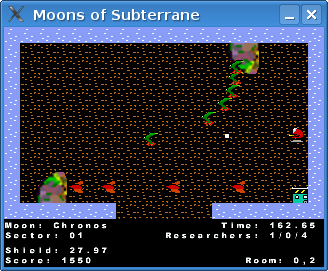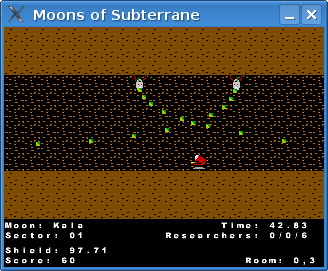
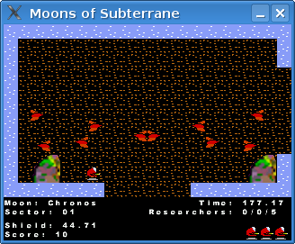

## Project Progress

This was created as an entry for Ludum Dare.

Being somewhat time constrained and ill at the time, I only really had maybe a maximum of 24-32 hours on it, rather than the full 48.

This showed in the total screwup of submission that I did, whereby I uploaded the source of the correct version, with a correct AMD64 Linux compiled binary, but an old Win32 binary!

Then, to keep to the rules as best I could, I uploaded a fixed EXE &#8211; as a patch to the original &#8211; but a lot of people didn&#8217;t quite catch it so my end scores showed a distinct Marmite like tendancy; really high marks for half of the voters, really low marks for the other half.

Development wise, it was fairly easy to do, and the map system I came up with is reasonably fancy &#8211; but really dependant on the flip-screen gameplay, as I don&#8217;t quite see it working properly in a scrolling map without perhaps caching the room you&#8217;re in and the immediately surrounding ones.

## Major Points To Consider

The screen resolution was designed for handhelds &#8211; specifically the Wiz, Dingoo and GP2X.. of which builds were done fairly quickly.

However, on the PC, with sky high resolutions, 320&#215;240 is just that bit too small these days. Think I should probably aim for 640&#215;480 as a minimum as then I can scale by two down to 320&#215;240 for the handhelds if need be. Actually, I should probably implement some sort of scaling routine into the engine, as that would fix all the problems!

The game was hard&#8230; stupidly hard in places ( the third level is a nightmare with a very tight time limit ) and without a huge amount of explanation of what&#8217;s going on, it&#8217;s a bit much.

Sound &#8230; should be turned off!

## Future Work

I think there&#8217;s something in Moons of Subterrane, so I do see me returning to it, and finishing it off properly.

I had always wanted to do a Cybernoid-esque flip-screen shooter, and I&#8217;m really pleased with how Moons of Subteranne actually came out, even in the short space of time it was created in!

## Downloads

[Full Source is available as part of the ludumdare github repo](https://github.com/stuckie/ludumdare)

## Resources Used

SGZEngine.

GIMP for graphics.

MilkyTracker for &#8220;sound effects&#8221;

KATE for the actual code editing.
