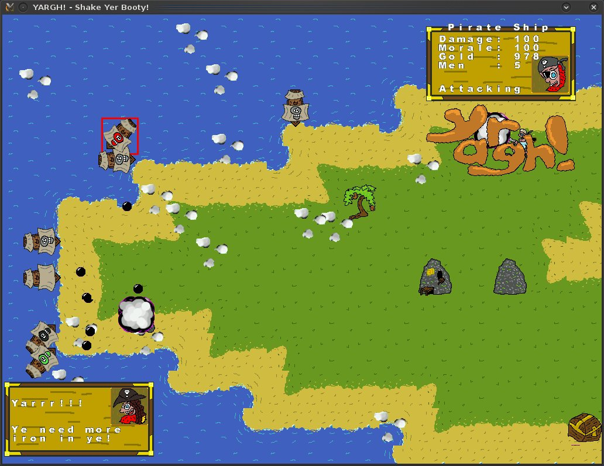
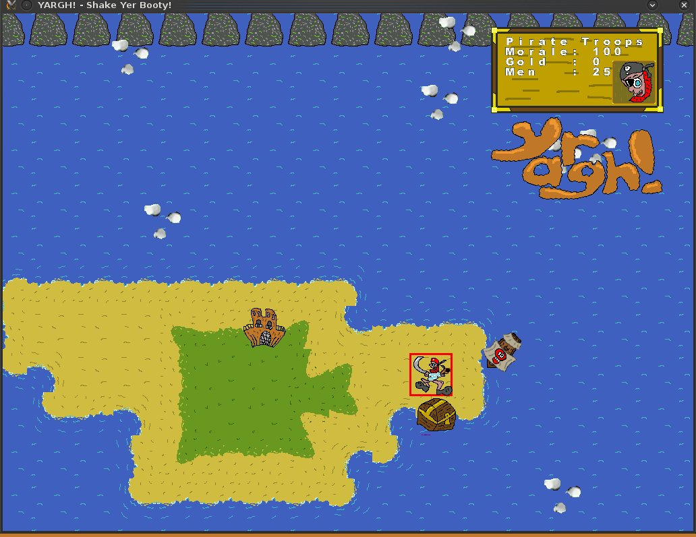
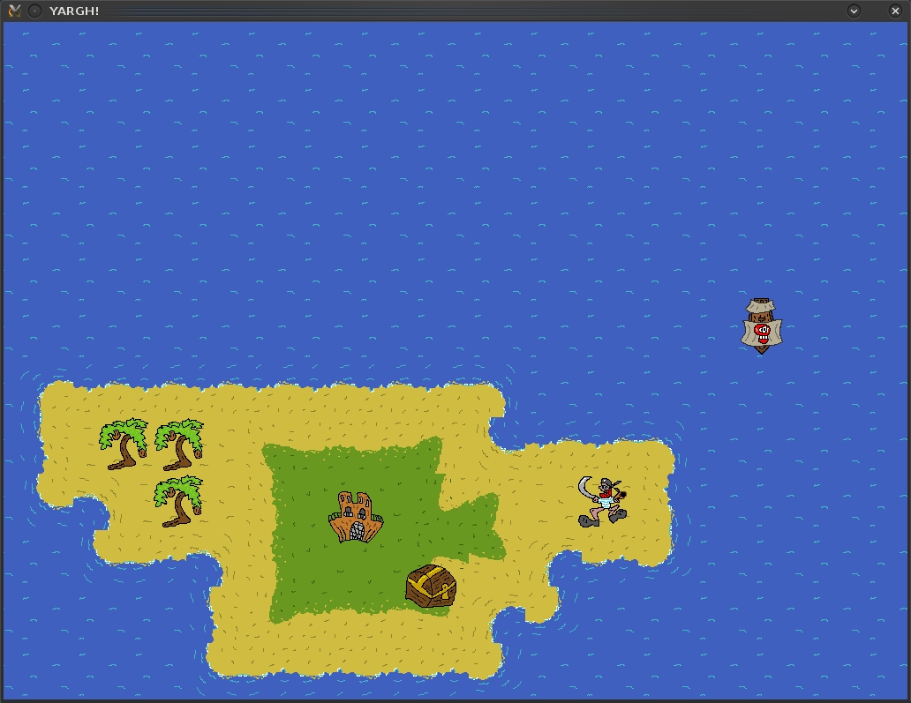

# Yargh! &#8211; Shake Yer Booty!

## Overview

Yargh! There be treasure in these parts! Loot &#8216;n&#8217; Plunder yer way across the seas where it&#8217;s each beard for themsels!.

Yargh! is a Real-Time Strategy game, where you control your ships and men to capture as many cities as possible, loot as many mines, find as much treasure, and be the deadliest pirates on the seven seas!  
Though you&#8217;re not alone as a number of other bearded pirates all have the same idea! Though they&#8217;ll soon get what&#8217;s coming to them! YARGH!

## Development Screenshots

## Project Progress

This was created as an entry for Ludum Dare.  
It is the last project to have used SGZEngine, and introduced smooth scrolling, mouse input, and masses of command-able units at once.  
This did show me that the engine was due for retirement however, as the mouse input is very laggy when there&#8217;s a lot on screen, and the tile painter isn&#8217;t the smartest of code either.  
Yargh! is, unfortunately, unfinished.. however it does provide a base for building upon at a later date.

## Major Points To Consider

The screen resolution was designed for PC use this time, hence it mostly running in 1024&#215;768 and the large screen shots above.  
A Mouse is also required to play.

## Future Work

With SGZEngine being retired, and no current engine taking it&#8217;s place, most of the SGZEngine projects are on hold till something comes up.  
However, Yargh! is somewhat unique in that it essentially completely bypasses the C-Engine and performs nearly everything Lua-side, making it one of the more easier games to port when a new engine is written.

## Downloads

[Full Source is available as part of the ludumdare github repo](https://github.com/stuckie/ludumdare)

## Resources Used

SGZEngine.  
GIMP for graphics.  
KATE for Lua code.  
CodeLite for any Engine modifications.
