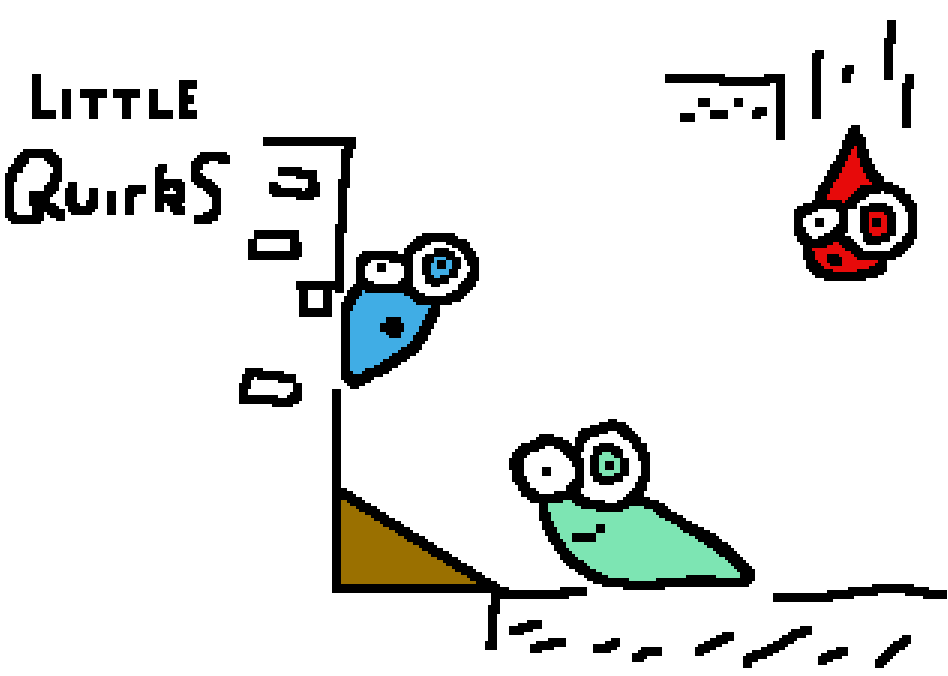

# Little Quirks

## Overview

Every winter, the Quirks make the journey through the mountain to the greener pastures on the other side.

They do this to escape the cold frost, and the snow, for they live underground and the frosted earth makes it hard to burrow through!

This year, however, there has been an earthquake and the usual passage they take through the mountain has been sealed up! They can&#8217;t go back, as winter is already beginning, and they wont be able to survive.

Help is at hand though!

The keeper of the mountain, an old wizard, has seen the Quirks through his magic mirror and can help them get through the mountain!

Old as he may be, and unable to help them physically, his magic is powerful enough to reshape the mountain to allow the Quirks to continue on their journey, and protect them from the beasties inside.

## Snap Shots

## Project Progress

This was started as an entry for Mini Ludum Dare.

It wasn&#8217;t finished in time due to a hard drive crash wiping out a fair amount of work.

In fact, it&#8217;s still not finished!

As I quite like the idea, I&#8217;ve been continuing it when I&#8217;ve had time to dedicate to it, so it&#8217;s still in the works.

## Tiny Critters Universe

Little Quirks is in the same universe as Tiny Critters, so there&#8217;ll be some crossover with that. Amusingly, they are both arcade puzzle games, but they&#8217;re slightly different in how they puzzle.

Tiny Critters is more akin to Chu Chu Rocket and Troddlers, in that you have a physical character, and you direct the flow of the Critters. Little Quirks, is more like Lemmings in that you&#8217;re not a physical entity as such, but unlike Lemmings, you cannot directly manipulate the Quirks &#8211; you can only change the layout of the level!

## Future Work

Little Quirks is still being made.

## Downloads

[Source can be grabbed as part of the Ludum Dare repository](http://github.com/stuckie/ludumdare)

## Resources (Being) Used

SGZEngine.

GIMP for graphics.

MilkyTracker for sound effects and music.

KATE for the actual code editing.

