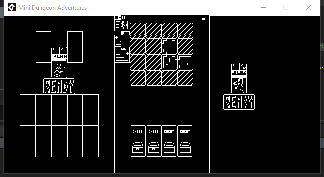

Mini Dungeon Adventures is a 1-Bit Clicker Jam Entry!

# Description

Mini Dungeon Adventures is a tiny rogue-like where you descend into ever changing dungeons, whack the beasties, and steal the treasure!
The deeper you go, the nastier the creatures, so drag that stash back up to the Tavern and sell it for better equipment before going down a new Dungeon.

Hastily thrown together over 20 hours, spread over a week of lunch times and evenings, Mini Dungeon Adventures isn't quite as polished as it could be, but it does show some promise.

It was an idea that was meant to be prototyped a while ago, but we never got round to. With the change to GameMaker Studio 2, and a jam appearing at just the right time, it seemed the perfect choice.

We will be returning to this in the future ( and perhaps sprucing this version up further as well. )

# Screenshots

# Credits

Released 14th April 2017, written using GameMaker Studio 2. 
Code, Graphics and Design - Steven “Stuckie” Campbell 
Additional Graphics and Design - Claire “Octopi” Campbell

# Availability

[itch.io](https://arcadebadgers.itch.io/mini-dungeon-adventures)

