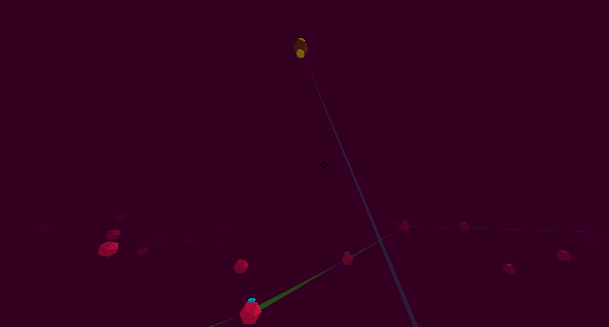

# -link> 
( submitted as astro-link at the last minute as someone already had "link" )

# Description

This was annoying! I started this in plenty of time, and got fairly far with it.
I ended up rewriting it a few times - with it originally being a sortof VR Squares - surround the asteroids in a chained link to clear them.
And before that, it was meant to be a 3D room based puzzle game with you sticking to floors and porting between walls.
All because A-Frame was actually rather easy to get up and running.

Sadly, I became a bit ill in the final week, just as I was trying to implement some sound - the third entry of the year to be silent, funnily enough.

It was fun though, and would certainly use A-Frame again for future VR fiddlings.

# Screenshots

# Credits

Released 13th September 2018, written by Steven "Stuckie" Campbell

# Availability

[JS13k](https://2018.js13kgames.com/entries/astro-link) 
[GitHub](https://github.com/ArcadeBadgers/js13k2018)
