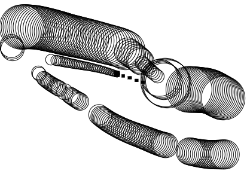

Pollute! was an entry for the JS1k 2018 Competition

# Description

I didn't mean to enter this.. it just so happened I had some free time, and was fiddling around with some JavaScript and this fell out of it!
In hindsight, I could've made it fit the theme better and be more of a game by randomly placing bitcoins around for you to collect, rather than just having you clear your own pollution as you moved around.
Pretty sure I had the space available to do it as well.

Certainly enjoyed it, and after missing out doing the previous year's JS13k, I was looking forward to 2018's version!

# Screenshots

# Credits

Released March 2018, written by Steven "Stuckie" Campbell

# Availability

[JS1k](https://js1k.com/2018-coins/demo/3088)
