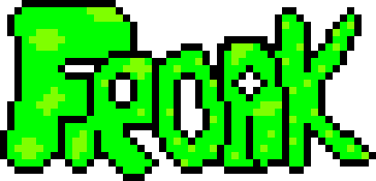
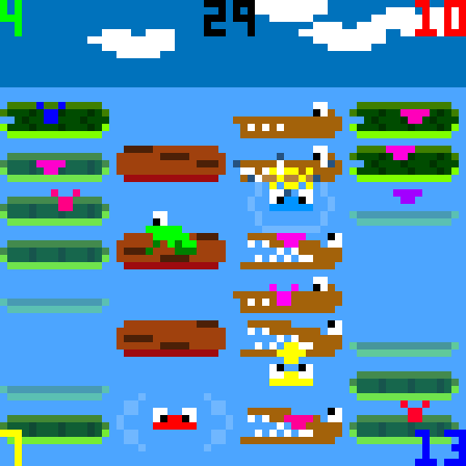
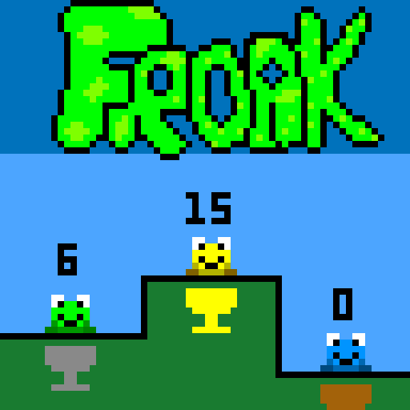
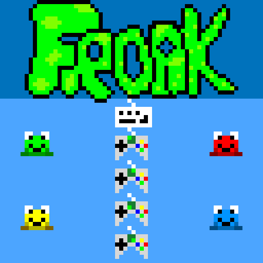

Froak was our entry into the 2017 LowRezJam

# Description

Froak is a multi-player party battler where you must eat more flies than your opponents!
It supports 0 - 4 players, where the AI takes control over the non-player controlled frogs.
You can use the keyboard and up to four Xbox 360 controllers.

There are five arenas, which are randomly chosen, each with a variety of hazards from drifting logs, sinking lily pads, and snappy crocs!
Slow down the other frogs by jumping on their heads when they've sank into the water - which'll daze them for a few precious seconds while you eat more flies!

# Screenshots

# Credits

Released 17th August 2017, written using GameMaker Studio 2. 
Code, Graphics, Sound and Design - Steven “Stuckie” Campbell 

# Availability

[itch.io](https://arcadebadgers.itch.io/froak)
