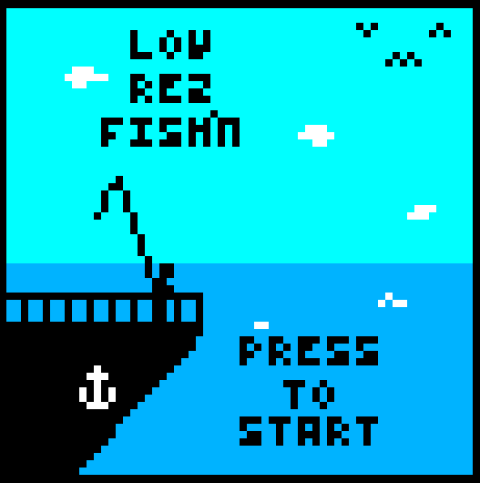
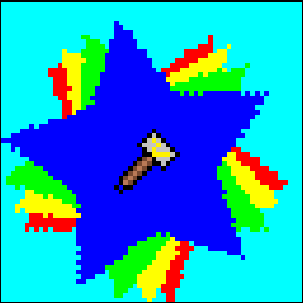
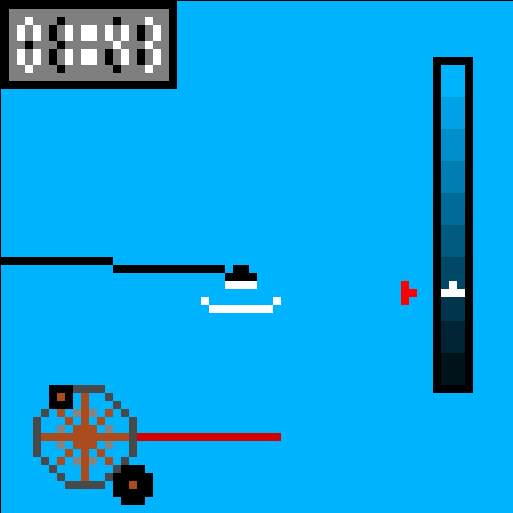
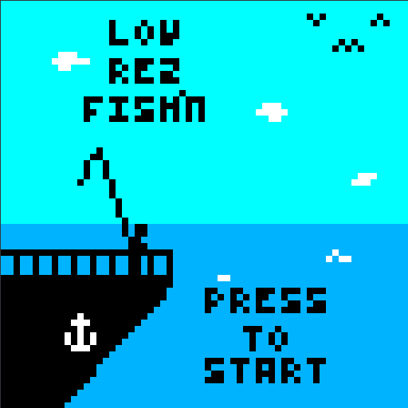

# Low Rez Fish'n

Low Rez Fish'n was released for the LowRezJam 2019!

# Description

Low Rez Fish’n is a small arcade-style fishing game, where you get a generated lake to fish for 16 unique items, before running out of time.

It was our first game written from scratch using a new toolchain, and in that regard it went very well. Even if it has no sound.

# Screenshots

# Credits

Released 17th August 2017, written in C using SDL2 and compiled through Emscripten for an HTML5 build.  
Code, Graphics, Design - Steven "Stuckie" Campbell

# Availability

[itch.io](https://arcadebadgers.itch.io/low-rez-fishn)
