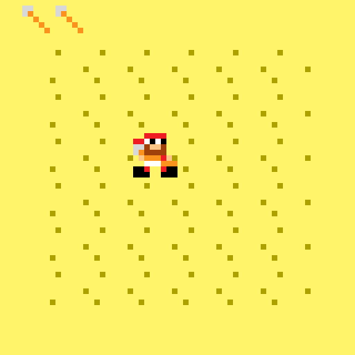

# Pixel Beard

Pixel Beard was released for the LowRezJam 2018!

# Description

Biting off more than I can chew seems to be a common trait with me.
Not only that, but I've had a good half dozen attempts at trying to do a rogue-like.. and this is the closest I've got to finishing one!

So yes, this was a hasty thrown together pirate-themed roguelite, with a number of mini-games for various actions such as:

- Sea fighting
- Sword fighting
- Treasure hunting
- Grog drinking

This also ended up with no sound due to lack of time to try it.

# Screenshots

# Credits

Released August 2018, written by Steven "Stuckie" Campbell

# Availability

[itch.io](https://arcadebadgers.itch.io/pixel-beard)
