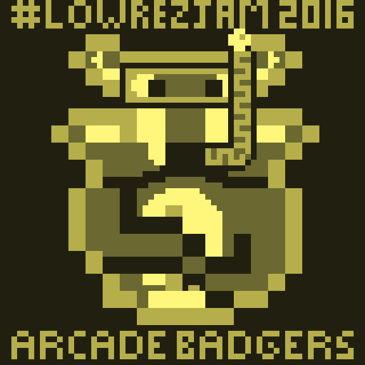

Sploosh! was created for the LowRezJam 2016

# Description

Sploosh! was written for the LowRezJam with a resolution of 64x64 in mind.
For it, I thought of taking on an underwater exploration game with a Gameboy aesthetic.
As such, it features a fairly large level, with the classic Gameboy palette as well as a bouncy chiptune title track, and relaxing ingame track.

Avoid the eels, crabs, and snap-happy clams while collecting the pearls and treasure.
Lug it back to your raft, slowly drifting away from the pool over time before it floats away and leaves you stranded.

You can play it on itch.io below.

# Screenshots

# Credits

Released 15th April 2016, written using GameMaker:Studio. 
Code, Audio, Graphics and Design - Steven “Stuckie” Campbell 
Additional Design - Claire “Octopi” Campbell

# Availability

[itch.io](https://arcadebadgers.itch.io/sploosh)
