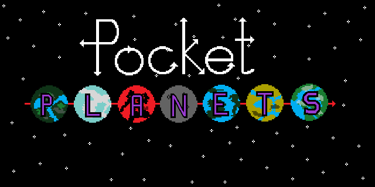

Pocket Planets was our attempt at LD38. It missed it, and is being released as-is with full source

# Description

Pocket Planets was done for Ludum Dare 38, but not submitted as it wasn't quite finished in time.

As I still don't have any time to finish it off at the moment, I'm releasing it as-is, including source with the bonus of the YYZ being able to load and run in the Trial version of GameMaker Studio 2!

There's likely bugs ( I found a crash bug that I couldn't reproduce again, so there's that lurking about ) so I wouldn't go using this straight off as a base for something else.

It is, however, an interesting little look at how much you can cram into the trial version of GameMaker Studio 2.. there's still resources available to expand it further, for instance, and further cleanup to do that'd give even more space to add things.

I'd like to go back to it, but that won't be for a long time.

So, what we do have just now is the bare bones of a 4X game.
You start with a home planet, two scouts and a colony ship. Your home planet's stats are already shown so you can fiddle with ecology, defence and ship building. Ecology deals with terraforming and pollution control, defence builds shields for your planet, and ship building controls how fast your chosen ship gets built.

First off, you'll want to left click a scout and send it to the nearest ( ? ) planet to see what it is. You do this by right clicking on the planet to send it there. Or you could right click in the middle of space to send it there, or right click on an enemy planet or ship to attack it. You can also drag a box around multiple ships to select them.

If you find a planet that looks closely like your home planet, you'll want to send your colony ship there to take it. If it's slightly off, you can terraform it to make it "ideal" with bumping up the planet's ecology stat. If it looks like a rock, ice cube or volcanic nasty thing, your colonists are likely going to die rather quickly if you don't spam that ecology stat, and depending on how bad the planet is, you may need a few  colony ships to get claim it.

Capture a few more planets, then perhaps start building attack ships before the AI does, as it'll be searching for hospitable planets as well.. and once it's done that, will go and attack everything in sight. It's quite ropey AI, but it looks impressive when there's lots going on at once - smoke and mirrors and all that.

And that's it, really.

There's no win/lose conditions, but at least it'll generate a new map each time you run it.

It's certainly come out as a quirky mix of Master of Orion, Galcon and Z.. so have fun with it, poke at it, and make it your own.

# Screenshots

# Credits

Released 14th April 2017, written using GameMaker Studio 2. 
Code, Graphics and Design - Steven “Stuckie” Campbell 
Additional Graphics - Claire “Octopi” Campbell

# Availability

[itch.io](https://arcadebadgers.itch.io/pocket-planets) 
[Full Source available as part of LudumDare GitHub repo](https://github.com/stuckie/ludumdare)
