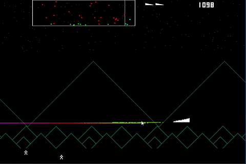
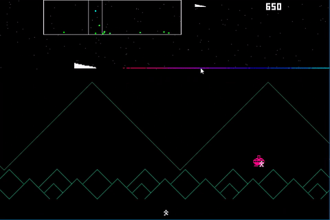

# Blast Zone

An experimental look into arcade-style touch controls

# Description

Blast Zone was effectively created within a week. Though that week was spread over an entire year.
It's a Defender clone with the idea of using touch controls, or two button mouse controls, rather than the usual keyboard/joystick/gamepad affair.
I think it came out pretty well.

The idea is to tidy up the source a bit and release it as a marketplace asset.

Though, when I'll get round to that, is anyone's guess.

# Screenshots

# Credits

Released August 2017, written by Steven "Stuckie" Campbell

# Availability

[itch.io](https://arcadebadgers.itch.io/blast-zone)
