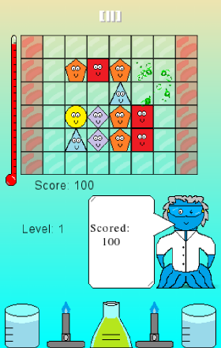
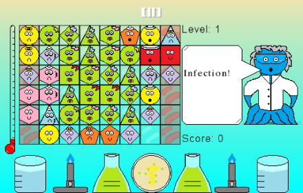

# Germies

Germies! is an Arcade-Puzzle game, with classic 16-bit styled graphics and sound!

# Description

Help Dr. Pus to contain an infection, by gathering Germies into squares or rectangles of similar types.  
Score more points with diseased Germies, but be warned that fully diseased Germies can only be removed by being surrounded within a frame of healthy Germies!  
Each wave of infection brings three more Germies to the grid, so make sure your incubation areas are kept clear!  
How long can you last?

# Screenshots

 

# Credits

Released on 12th July 2013, Germies! was written in Javascript, using the HTML5 Canvas.  
Germies! uses ImpactJS, parts of Jesse Freeman’s Impact Starter Kit
Design, Programming and Sound by Steven “Stuckie” Campbell  
Art and Additional Design by Claire “Octopi” Campbell

# Availability

[Here](http://germies.arcadebadgers.co.uk)
