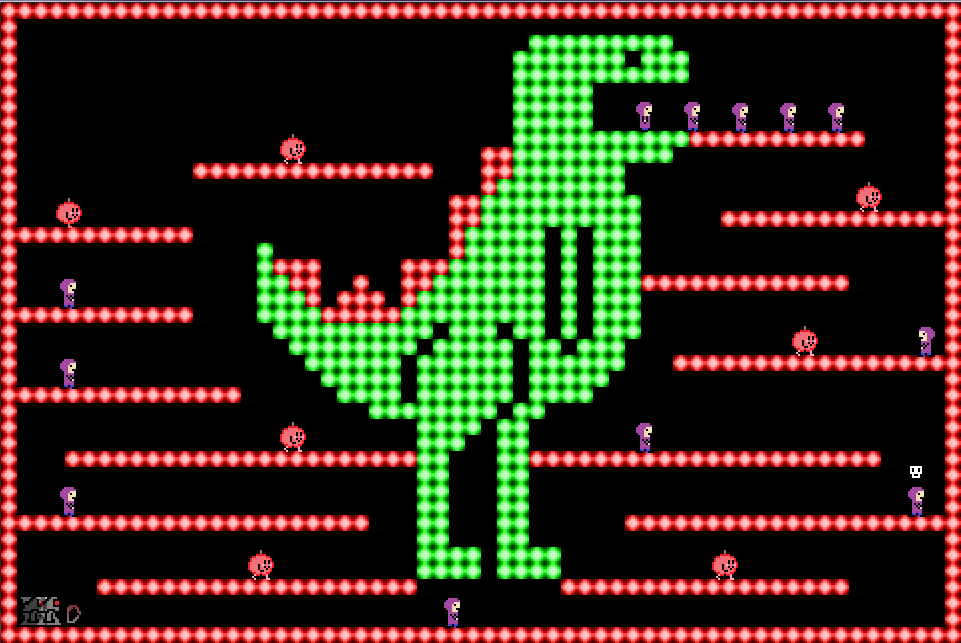
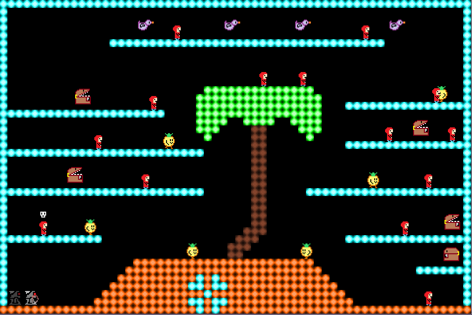

Grim is an Arcade-Action game, with classic 8-bit styled graphics and sound! 

# Description

Grim is in trouble.

Mama is not happy with him after going on his little outburst at Christmas; reaping souls willy-nilly and upsetting the order of the realms. He’s already upset Him downstairs, and if he doesn’t put right the mess he’s made, Him upstairs will be having a word too!

Help Grim through 100 levels of Classic Arcade Action!
Reap the lost souls stuck in the wrong realm before they turn bad!
Watch out for the other inhabitants of the realm, who aren’t best pleased with what you’ve done!

And you better get it done before bedtime, or Mama Grim will be reaping your soul, instead!

Grim has 100 levels of pure Arcade action!
Support for up to 4-player co-op!
Three difficulty levels so everyone can play!
Score chaining mechanics!

# Screenshots

# Credits

Released 24th May 2014, Grim was written using GameMaker:Studio. 
Code, Music, Sound, Additional Levels and Design - Steven “Stuckie” Campbell 
Art, Design and Levels - Claire “Octopi” Campbell

# Availability

[itch.io](https://arcadebadgers.itch.io/grim)
