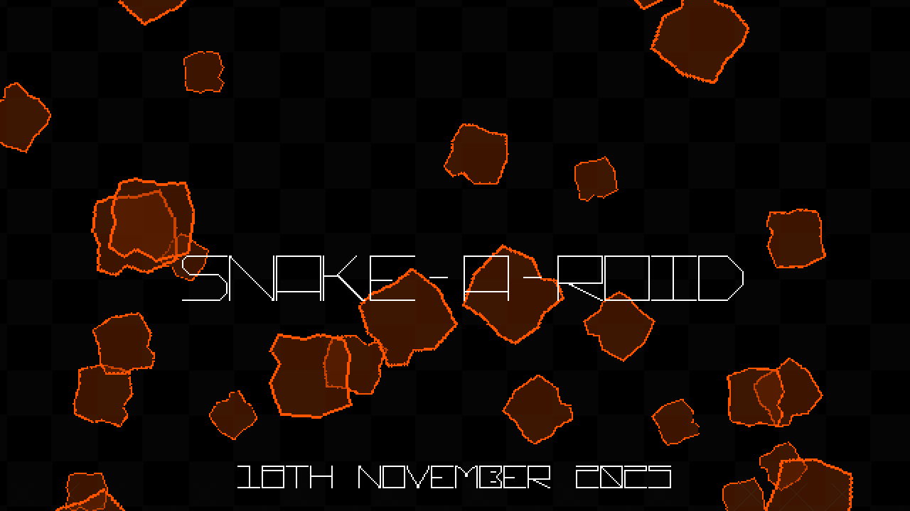
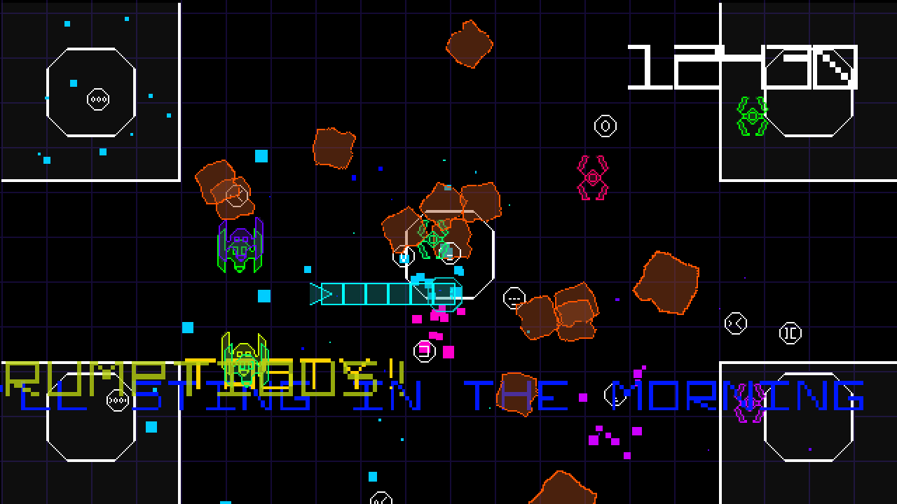
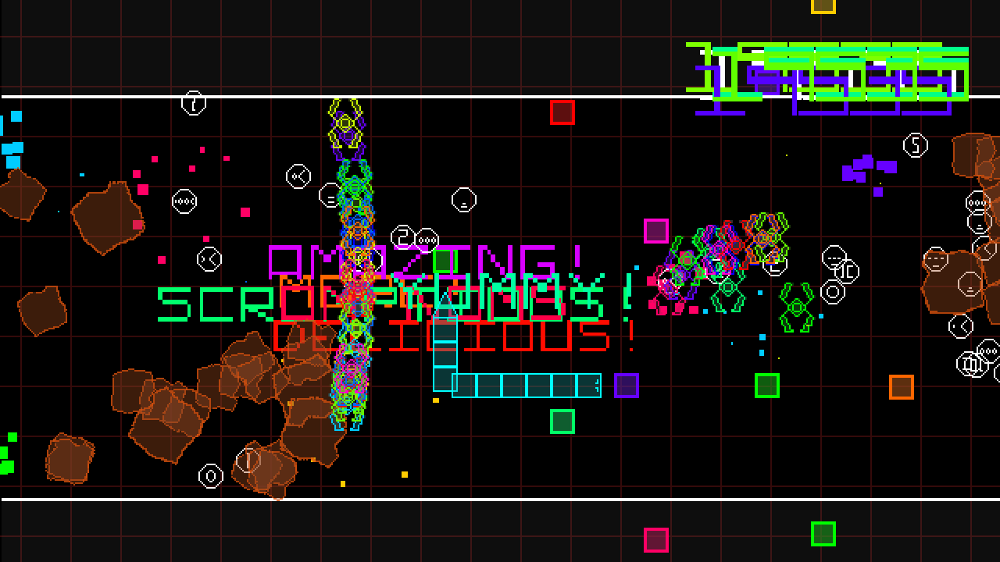
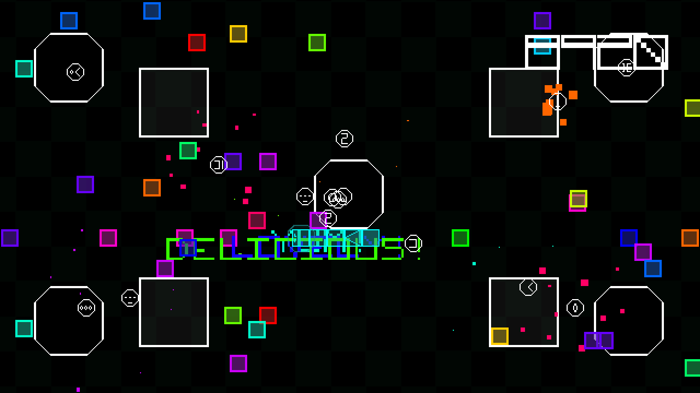

# Snake-A-Roid

# Description

Snake-A-Roid is an Arcade style game that’s been lost down the back of the sofa.

Featuring a clean vector-like style, and crunchy chip tune sound track, it evokes an era where games taunted you to spend your money, as you climbed to the top of that high score table.

Featuring three modes of play:

- Arcade - run through the 10 arenas, each with multiple waves of asteroids and aliens, with an arena guardian to defeat.
- Survival - pick an arena and chase that score, before your snake runs out of segments.
- Boss Run - go toe to toe with all the arena guardians, one after the other, before facing off against The Badger.

Multiple power-ups to feed your snake, including:

- 3-way split shot
- Faster bullets
- Bigger bullets
- Snake shield
- Smart bombs
- And the ever tasty extra life
- All of which stack up to turn your garden snake into a death adder.

This version was released for Steam for Windows, Desktop Linux and SteamDeck, and is a 2.0 version to the original [Snake-A-Roid](/releases/arcadebadgers/snake-a-roid/index.html)

# Screenshots

# Trailer

[Watch on YouTube](https://www.youtube.com/watch?v=s-u2YnY7zBo)

# Credits

Released 18th November 2025, written using GameMaker 
Code, Audio, and Additional Graphics and Design - Steven “Stuckie” Campbell 
Graphics and Design - Claire “Octopi” Campbell

# Availability

[itch.io](https://arcadebadgers.itch.io/snake-a-roid)  
[steam](https://store.steampowered.com/app/690320/SnakeARoid)
