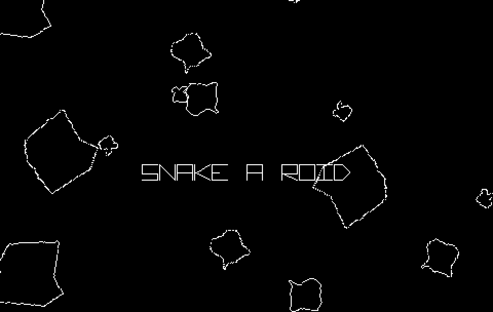

# Snake-A-Roid

# Description

Let's go back in time to the glory days of the Arcades and high scores while we mash up two iconic games.
Snake-A-Roid pits you against ever increasing hordes of asteroids as you control your snake to shoot them, collect power-ups, and survive as long as possible.

Battle through ten arenas in Arena mode, or last as long as possible in Survival mode on your pick of arena.
Collect one of six power-ups including triple shot, bigger bullets, faster bullets, temporary shield, and tail shot. Stack them all up to be an asteroid killing machine. Or if you're lucky, you may hit a smart bomb or two.
Clean wireframe graphics, making it accessible to those requiring high contrast graphics, or those with colour blindness.
Three difficulty settings to choose from.
Support for keyboard or the Xbox 360 gamepad.
A crunchy chiptune soundtrack to bob along to.

Currently available for Windows only on itch.io

More platforms will follow in due course.

Snake-A-Roid was originally done for the Ludum Dare MiniLD #67
The entry page for that is available [here](http://ludumdare.com/compo/minild-67/?action=preview&uid=267) which includes an early version of the game playable in your browser for free.

# Screenshots

# Credits

Released 2nd August 2016, written using GameMaker:Studio. 
Code, Audio, Graphics and Design - Steven “Stuckie” Campbell 
Additional Design - Claire “Octopi” Campbell

# Availability

[itch.io](https://arcadebadgers.itch.io/snake-a-roid)

[minild](http://ludumdare.com/compo/minild-67/?action=preview&uid=267)
