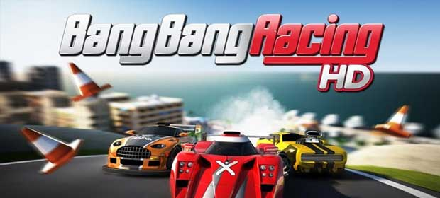

# Bang Bang Racing THD/HD

# Description
A home console racing experience designed and optimized for NVIDIA® Tegra™-powered mobile devices and which utilizes NVIDIA® PhysX™ technology. 
Bang Bang Racing THD is a fun, action-packed racing game that has cool visuals and pumped-up sports cars. But underneath its playful exterior, it has the pumping heart of a true racing game. Real-time dynamic physics allow for finesse and control – drifting through corners and clipping every apex delivers huge player satisfaction. 
The game also features a unique control system allowing you to simply point where you want the car to go, as if you are drawing a racing line for the car to follow. 

Features: 
<ul>
<li>
  A brand new IP giving you an exclusive home console experience for your mobile device.
</li>
<li>
  8 stunning tracks based on world-wide locations.
</li>
<li>
  4 Racing classes including: Muscle based “N-Dura”, Sports style “Evo GT”, ALPS based “Protech” and open wheel style “Apex”.
</li>
<li>
  20 cars in total with each car having its own handling model and selection of skins.
</li>
<li>
  Dynamic objects including exploding water, oil and fire barrels, as well as cones and tyres.
</li>
<li>
  The game also features, single race, time trial, championship and reverse track modes.
</li>
<li>
  In-depth unlockable achievements and leaderboard’s using Openfeint that lets you see where you rank amongst friend and foes globally.
</li>
</ul>

*Only Tegra 2 has given us the power to deliver our original IP from Playstation 3 to mobile devices without any loss in quality in fact the touch controls we have incorporated has made it more accessible than ever.*

BBR THD was specific to Tegra 2 devices whereas BBR HD was not

# Screenshots

