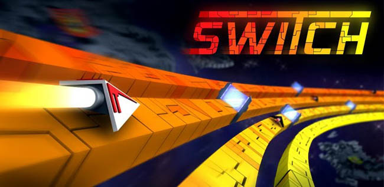
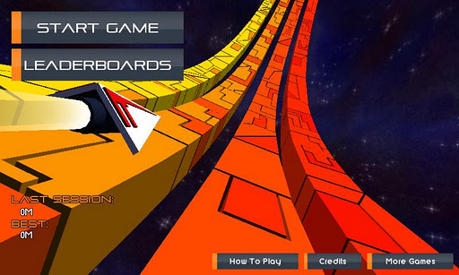
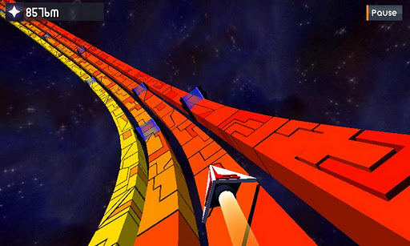
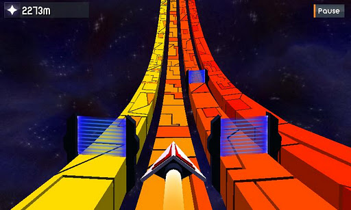

# Switch Plus

# Description
Welcome to one of the fastest gaming experiences on Android and iOS. Switch sets you against obstacles and opponents as you weave your way through space and time. Your goal is to travel as far as possible while avoiding the energy beams that will destroy your ship. Time your switches correctly to also avoid the enemy ships. If you need some help, collect the shield power-ups that will let you smash through your opponents and achieve top scores. 
You will be amazed by the incredible graphics, high quality sounds and the sheer speed of the game, how long can you last?

Switch Plus removes the ads and gives you a +5000 starting boost.

Features:
<ul>
<li>
  Simple and addictive gameplay.
</li>
<li>
  Console quality visuals and sounds.
</li>
<li>
  Original sound and music.
</li>
<li>
  Online leaderboards using OpenFeint.
</li>
</ul>

# Screenshots

